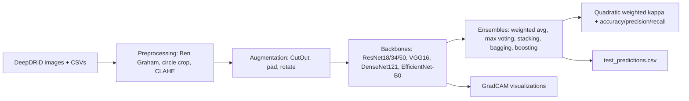

# EyeAI-Retinopathy-Detection

Diabetic retinopathy grading on the DeepDRiD fundus dataset with PyTorch: transfer-learning baselines across five CNN backbones, bagging/boosting/stacking ensembles, retina-specific preprocessing, and GradCAM explanations. Built as a deep learning course final project (instructions PDF included in the repo).

## The task

Grade retinal fundus photographs into the five standard DR levels (0 = no DR through 4 = proliferative). Models are scored with quadratic weighted Cohen's kappa, the usual metric for ordinal grading; training keeps the checkpoint with the best validation kappa. The DeepDRiD images and their train/val/test annotation CSVs are committed under `DeepDRiD/` (2,000 images, two views per eye, e.g. `1_l1` and `1_l2`), so the part A experiments run out of the box.

## What is in here

Backbones actually used in the code: ResNet18, ResNet34, ResNet50, VGG16, DenseNet121, and EfficientNet-B0. Each script wraps a torchvision backbone in a `MyModel` class that replaces the stock classifier with a three-layer head (in_features to 256 to 128 to 5) with ReLU and dropout 0.5.

Beyond the baselines:

- Spatial attention on VGG16 (`vggwithSpacingattention.py`): a gate built from channel-wise average and max maps, concatenated and passed through a conv + sigmoid, multiplied onto the backbone feature maps before classification.
- Dynamic oversampling (`partA/resnetWithDynamicOversampling.py`): a `WeightedRandomSampler` with inverse-frequency class weights to counter the grade imbalance in DR data.
- Dual-view loading: the dataset class supports `single` and `dual` modes, where dual mode pairs both photographs of the same eye.
- Ensembles (`ensemble.py`, `aio.py`): weighted averaging and max voting over model logits, plus feature-level stacking with scikit-learn (GradientBoosting, RandomForest, StackingClassifier). The `bagging/`, `boosting/`, and `stacking/` directories hold per-backbone runs of each strategy.
- Retina preprocessing (toggled via a config dict in `aio.py`): Ben Graham weighted Gaussian subtraction, circular crop, CLAHE, blur, sharpen; augmentations include CutOut, random padding, and fundus-specific random rotation.
- Transfer to a second dataset (`resnet50partB.py`): ResNet50 retrained on a second Kaggle retinopathy dataset (`Bdataset/trainLabels.csv`, resized cropped images), with `downloadBDataSet.py` fetching APTOS 2019 via `kagglehub` and `Bdataexploration.py` for a first look at its label distribution.

`aio.py` is the consolidated pipeline: a `CONFIG` dictionary selects which backbones to train, which ensemble method to apply, and which preprocessing steps to enable, then evaluates and writes `test_predictions.csv` in the format used for Kaggle-style scoring. Defaults: 224 x 224 inputs, batch size 24, lr 1e-4, 25 epochs.

## Pipeline



## Repository layout

```
partA/                      Transfer-learning baselines: resnet, resnet50, densenet, vgg,
                            resnetWithDynamicOversampling
bagging/ boosting/          One script per backbone and ensemble strategy
stacking/                   (resnet18, resnet34, vgg16 variants)
aio.py                      Config-driven all-in-one pipeline (models, ensembles, preprocessing)
ensemble.py                 EnsembleMethods: weighted average, max voting, stacking
all_models_for_ensemble.py  Trains the member models used by the ensembles
vggwithSpacingattention.py  VGG16 + spatial attention gate
resnet50partB.py            Part B: transfer to the second Kaggle dataset
efficientnet_b0.py          EfficientNet-B0 baseline
visualization.py            GradCAM (forward/backward hooks) + training curves
downloadBDataSet.py         kagglehub download helper for APTOS 2019
pre/how_to_use.py           Loading local pretrained weights into the backbones
trained_models/             Committed checkpoints: resnet18, resnet34, vgg
visualizations/             Committed GradCAM outputs and training-history plots per model
DeepDRiD/                   Dataset: train/ val/ test/ images plus annotation CSVs
tempelate_code.py           Course-provided template the project builds on
```

## Getting started

```bash
git clone https://github.com/hsn07pk/EyeAI-Retinopathy-Detection.git
cd EyeAI-Retinopathy-Detection
pip install -r requirements.txt   # torch, torchvision, numpy, pandas, scikit-learn, Pillow, tqdm
```

Train a single baseline (paths to `./DeepDRiD/` are set inside each script):

```bash
python partA/resnet.py
```

Run the configurable pipeline; edit the `CONFIG` dict at the top of the file to pick backbones, ensemble method, and preprocessing steps:

```bash
python aio.py
```

Part B needs the second dataset in `./Bdataset/`; `python downloadBDataSet.py` pulls APTOS 2019 through kagglehub (requires Kaggle credentials).

Training prints per-epoch train and validation kappa, accuracy, precision, and recall, and saves the best-kappa checkpoint. GradCAM figures and metric curves land in `./visualizations/`.

## Explainability

`visualization.py` implements GradCAM with forward and backward hooks on the last convolutional block, producing class-discriminative heatmaps over the fundus images. Committed examples:


## Notes and limitations

- No benchmark numbers are quoted here because no evaluation logs are committed; kappa and accuracy are printed at train time, and the committed training-history plots show the curves for the three saved models.
- Scripts are deliberately self-contained (each carries its own dataset class and training loop), so there is duplication between files; `aio.py` is the deduplicated version.
- `pre/pretrained/*.pth` weights referenced by some scripts are not committed; torchvision's `pretrained=True` path works without them.
- This is coursework, not a medical device; nothing here is validated for clinical use.

## References

- [DeepDRiD challenge paper](https://www.sciencedirect.com/science/article/pii/S2666389922001040)
- [GradCAM paper](https://arxiv.org/abs/1610.02391)
